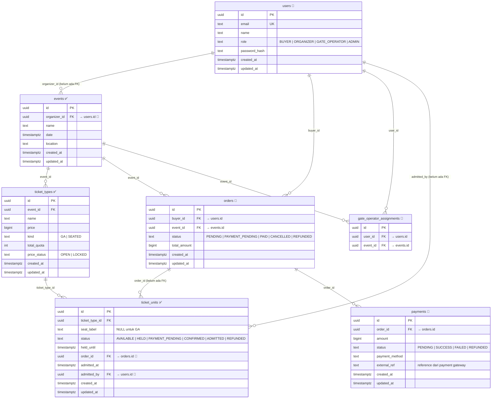

# Entity-Relationship Diagram

> Diagram di bawah dirender otomatis oleh GitHub (Mermaid).  
> Tabel dengan label ✅ sudah ada. Tabel dengan label 🔲 masih perlu diimplementasikan.



---

## Status Tabel

| Tabel | Status | Modul | Migration |
|---|---|---|---|
| `events` | ✅ Ada | Inventory (PRD-01) | `000001` |
| `ticket_types` | ✅ Ada | Inventory (PRD-01) | `000001` |
| `ticket_units` | ✅ Ada + extended | Inventory + Check-in | `000001`, `000003` |
| `users` | 🔲 Belum ada | Auth (TDD-02) | `000004` |
| `gate_operator_assignments` | 🔲 Belum ada | Auth/RBAC (TDD-02) | `000004` |
| `orders` | 🔲 Belum ada | Orders (PRD-04) | `000005` |
| `payments` | 🔲 Belum ada | Payments | `000005` |

---

## Catatan Desain

### Kolom yang perlu diupgrade menjadi FK proper

Kolom-kolom berikut saat ini bertipe `UUID` atau `TEXT` tanpa FK constraint — akan di-enforce setelah tabel target dibuat:

| Kolom | Tabel | Target FK |
|---|---|---|
| `ticket_units.order_id` | ticket_units | `orders.id` |
| `ticket_units.admitted_by` | ticket_units | `users.id` |
| `events.organizer_id` | events | `users.id` (perlu ditambah kolom) |

### Status Machine `orders`

```
PENDING → PAYMENT_PENDING → PAID
                          ↘
                        CANCELLED
PAID → REFUNDED
```

Sinkron dengan `ticket_units.status`: saat order PAID → semua ticket_units-nya CONFIRMED. Saat order REFUNDED → semua ticket_units-nya REFUNDED.

### RBAC Gate Operator

`gate_operator_assignments` adalah junction table many-to-many antara `users` (role = GATE_OPERATOR) dan `events`. Gate operator hanya bisa scan tiket dari event yang ada di tabel ini — di-enforce di middleware sebelum `ScanTicketUseCase`.
