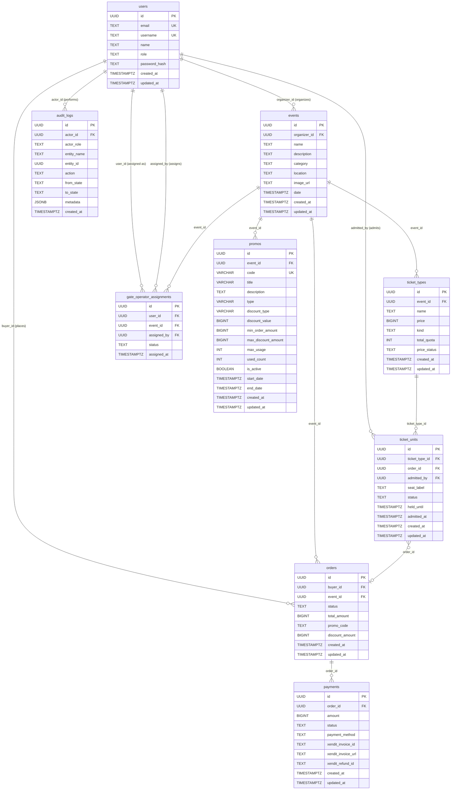

# Entity Relationship Diagram

## Keterangan Status

### `ticket_units.status`
`AVAILABLE` → `HELD` → `PAYMENT_PENDING` → `CONFIRMED` → `ADMITTED`
`HELD` / `PAYMENT_PENDING` / `CONFIRMED` → `REFUNDED`

### `orders.status`
`PENDING` → `PAYMENT_PENDING` → `PAID` → `REFUND_REQUESTED` → `REFUND_ORGANIZER_APPROVED` → `REFUNDED`
`PAYMENT_PENDING` → `PAYMENT_DISCREPANCY`
`PENDING` / `PAYMENT_PENDING` → `CANCELLED`

### `payments.status`
`PENDING` → `SUCCESS` / `FAILED` / `REFUNDED`

### `users.role`
`BUYER` | `ORGANIZER` | `GATE_OPERATOR` | `ADMIN`

### `ticket_types.kind`
`GA` (General Admission) | `SEATED`

### `promos.type`
`VOUCHER` (global) | `PROMO` (spesifik per event)

### `promos.discount_type`
`PERCENTAGE` | `FIXED_AMOUNT`
