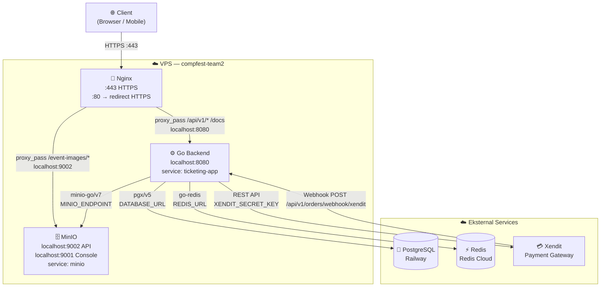
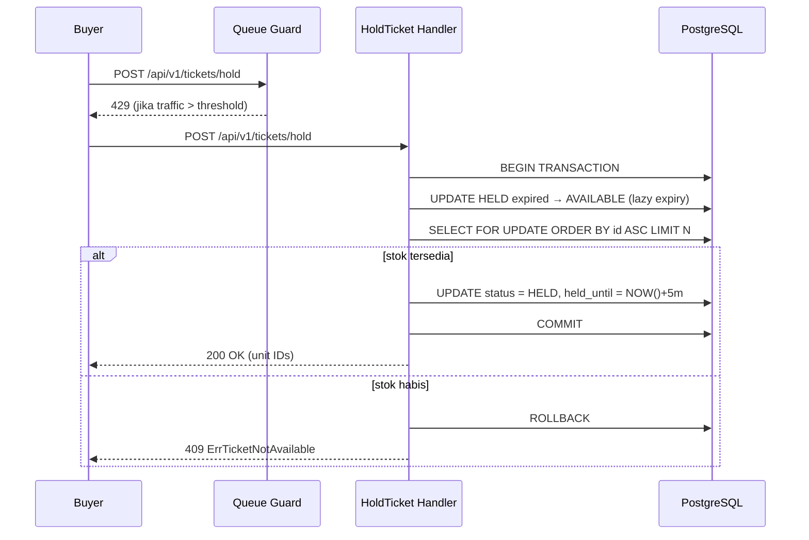
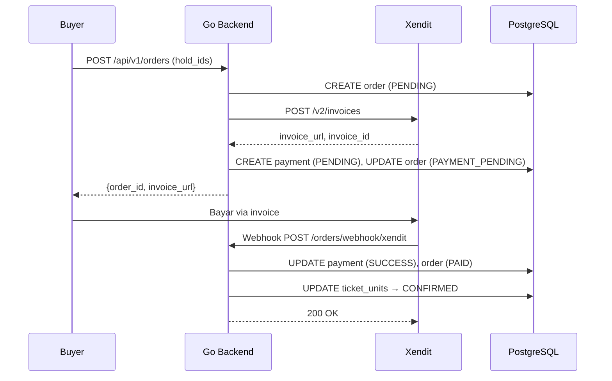
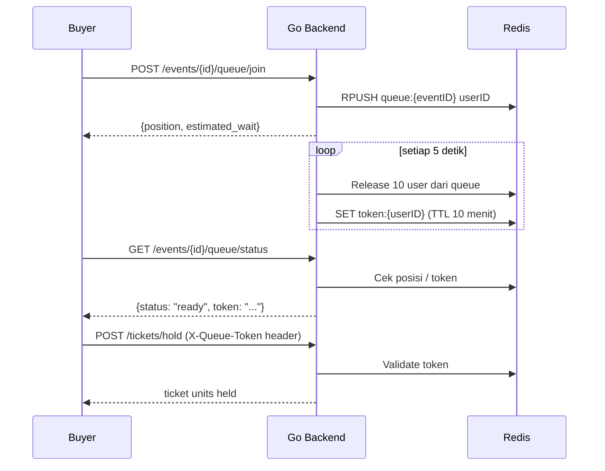

# System Design Diagram

## Arsitektur Deployment

## Arsitektur Aplikasi (Clean Architecture)

```mermaid
graph TD
    subgraph DELIVERY ["Delivery Layer (HTTP Handlers)"]
        H1["auth/delivery"]
        H2["events/delivery"]
        H3["orders/delivery"]
        H4["checkin/delivery"]
        H5["queue/delivery"]
        H6["inventory/delivery"]
        H7["dashboard/delivery"]
        H8["promos/delivery"]
        H9["admin/delivery"]
    end

    subgraph APPLICATION ["Application Layer (Use Cases)"]
        A1["RegisterUC\nLoginUC"]
        A2["CreateEventUC\nUploadImageUC"]
        A3["CreateOrderUC\nConfirmPaymentUC\nRequestRefundUC\nApproveRefundUC"]
        A4["IssueTicketUC\nScanTicketUC"]
        A5["JoinQueueUC\nValidateTokenUC"]
        A6["HoldTicketUC\nExpireHeldUC"]
        A7["GetMetricsUC"]
        A8["ValidatePromoUC\nAdminPromoUC"]
        A9["ReassignTicketUC"]
    end

    subgraph DOMAIN ["Domain Layer (Entities & Rules)"]
        D1["User\nRole"]
        D2["Event"]
        D3["Order\nOrderStatus"]
        D4["TicketQR"]
        D5["QueueToken"]
        D6["TicketUnit\nTicketUnitStatus"]
        D7["Promo"]
    end

    subgraph INFRA ["Infrastructure Layer (DB & External)"]
        I1["postgres_auth_repository"]
        I2["postgres_event_repository\nminio_storage_provider"]
        I3["postgres_order_repository\nxendit_payment_provider"]
        I4["postgres_checkin_repository"]
        I5["redis_queue_repository"]
        I6["postgres_ticket_repository\ncron_expiry_worker"]
        I7["postgres_promo_repository"]
        I8["postgres_admin_repository"]
    end

    H1 --> A1 --> D1
    H2 --> A2 --> D2
    H3 --> A3 --> D3
    H4 --> A4 --> D4
    H5 --> A5 --> D5
    H6 --> A6 --> D6
    H8 --> A8 --> D7
    H9 --> A9

    A1 --> I1
    A2 --> I2
    A3 --> I3
    A6 --> I6
    A4 --> I4
    A5 --> I5
    A7 --> I6
    A8 --> I7
    A9 --> I8
```

## Alur Anti-Oversell (Hot Path)

## Alur Pembayaran

## Alur Queue / Waiting Room

## Infrastruktur CI/CD

```mermaid
graph LR
    DEV["👨‍💻 Developer"]
    GH["GitHub\nmain branch"]

    subgraph CI ["CI — ubuntu-latest"]
        CI1["go build ./..."]
        CI2["go vet ./..."]
        CI3["Unit Tests\n(domain + application)"]
        CI4["Integration Tests\n(infrastructure + Postgres)"]
    end

    subgraph CD ["CD — ubuntu-latest"]
        CD1["Build binary\nlinux/amd64"]
        CD2["Stop service\n(systemctl stop)"]
        CD3["SCP binary +\nmigrations ke server"]
        CD4["chmod +x\nsystemctl start"]
        CD5["Health check\n/docs retry 10x"]
    end

    SERVER["🖥️ VPS\nauto-migration\nsaat startup"]

    DEV -->|"git push"| GH
    GH --> CI
    CI -->|"merge ke main"| CD
    CD1 --> CD2 --> CD3 --> CD4 --> CD5
    CD5 -->|"deploy OK"| SERVER
```

