# Use Case Diagram

```mermaid
graph LR
    BUYER(["👤 Buyer"])
    ORGANIZER(["👤 Organizer"])
    GATE_OP(["👤 Gate Operator"])
    ADMIN(["👤 Admin"])
    XENDIT(["⚙️ Xendit\n(Payment Gateway)"])

    subgraph AUTH ["🔐 Auth"]
        UC1["Register"]
        UC2["Login"]
    end

    subgraph EVENTS_UC ["🎟️ Events"]
        UC3["Browse Events"]
        UC4["Create Event"]
        UC5["Edit Event"]
        UC6["Upload Event Image"]
        UC7["View Event Metrics"]
    end

    subgraph TICKET_UC ["🎫 Ticketing"]
        UC8["Hold Ticket"]
        UC9["View Ticket Status"]
    end

    subgraph ORDER_UC ["🛒 Orders & Payments"]
        UC10["Create Order"]
        UC11["Pay via Xendit"]
        UC12["Confirm Payment\n(Webhook)"]
        UC13["View Order History"]
        UC14["Request Refund"]
        UC15["Approve Refund\n(Organizer)"]
        UC16["Approve Refund\n(Admin)"]
        UC17["Handle Payment\nDiscrepancy"]
    end

    subgraph PROMO_UC ["🏷️ Promos"]
        UC18["Validate Promo Code"]
        UC19["Create Promo"]
        UC20["Manage Promos"]
    end

    subgraph CHECKIN_UC ["✅ Check-in"]
        UC21["Issue QR Ticket"]
        UC22["Scan QR Ticket"]
    end

    subgraph QUEUE_UC ["⏳ Queue / Waiting Room"]
        UC23["Join Queue"]
        UC24["Check Queue Status"]
        UC25["Validate Queue Token"]
    end

    subgraph ADMIN_UC ["🛡️ Admin"]
        UC26["Manage Users"]
        UC27["Reassign Ticket"]
        UC28["View Audit Logs"]
        UC29["View Disputes"]
    end

    BUYER --> UC1
    BUYER --> UC2
    BUYER --> UC3
    BUYER --> UC8
    BUYER --> UC9
    BUYER --> UC10
    BUYER --> UC11
    BUYER --> UC13
    BUYER --> UC14
    BUYER --> UC18
    BUYER --> UC21
    BUYER --> UC23
    BUYER --> UC24
    BUYER --> UC25

    ORGANIZER --> UC2
    ORGANIZER --> UC4
    ORGANIZER --> UC5
    ORGANIZER --> UC6
    ORGANIZER --> UC7
    ORGANIZER --> UC15
    ORGANIZER --> UC19
    ORGANIZER --> UC20

    GATE_OP --> UC2
    GATE_OP --> UC22

    ADMIN --> UC2
    ADMIN --> UC16
    ADMIN --> UC17
    ADMIN --> UC26
    ADMIN --> UC27
    ADMIN --> UC28
    ADMIN --> UC29

    XENDIT --> UC12
```

## Keterangan Aktor

| Aktor | Deskripsi |
|---|---|
| **Buyer** | Pengguna yang membeli tiket event |
| **Organizer** | Penyelenggara event, bisa buat dan kelola event |
| **Gate Operator** | Petugas pintu masuk event, hanya bisa scan tiket |
| **Admin** | Super admin, bisa kelola semua aspek sistem |
| **Xendit** | Payment gateway eksternal yang mengirim webhook konfirmasi pembayaran |

## Alur Utama

### Beli Tiket
`Join Queue` → `Hold Ticket` → `Create Order` → `Pay via Xendit` → `Confirm Payment (Webhook)` → `Issue QR Ticket`

### Refund 2-tahap
`Request Refund (Buyer)` → `Approve Refund (Organizer)` → `Approve Refund (Admin)` → tiket di-`REFUNDED`

### Check-in
`Scan QR Ticket (Gate Operator)` → tiket status `ADMITTED`
